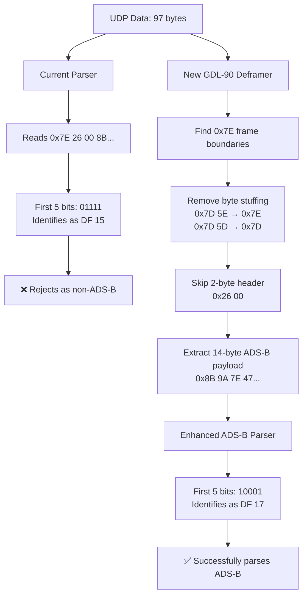
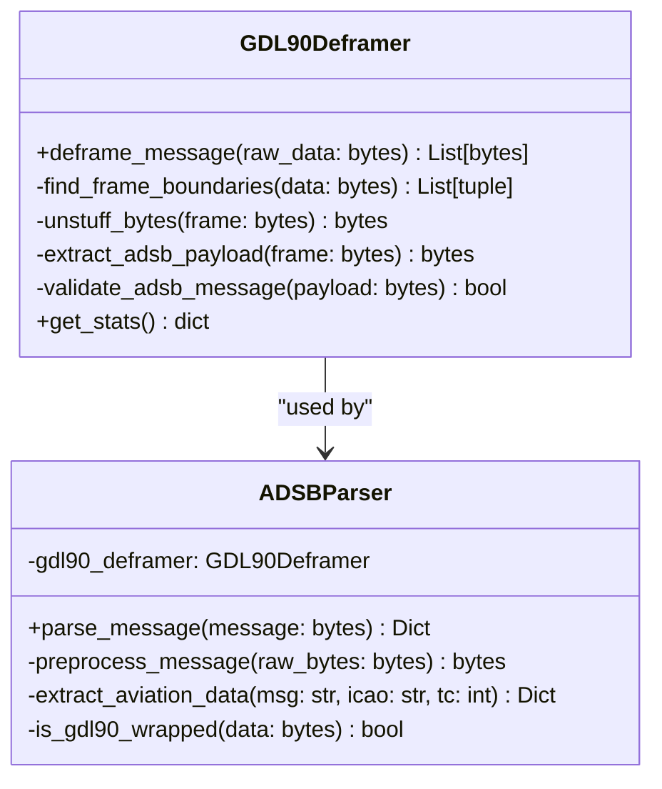

# GDL-90 Deframer Implementation Plan

## Problem Statement

The ADS-B parser is currently receiving GDL-90/KISS wrapped data but attempting to parse the wrapper instead of extracting the actual ADS-B message inside. This causes the parser to misidentify DF 15 messages instead of the actual DF 17 ADS-B Extended Squitter messages.

### Current Issue
- UDP payload contains GDL-90 framed data (97 bytes)
- Parser reads wrapper bytes `0x7E 26 00 8B...`
- First 5 bits are `01111` (DF 15) from the `0x26` byte
- Parser rejects as non-ADS-B message
- Actual DF 17 ADS-B message (`0x8B...`) is hidden inside the wrapper

### Expected Solution
- Implement GDL-90/KISS deframing
- Extract 14-byte ADS-B payload from wrapper
- First 5 bits become `10001` (DF 17)
- Parser successfully identifies and processes ADS-B messages

## Data Flow Analysis



## Implementation Strategy

### Phase 1: Create GDL-90 Deframer Module

Create `gdl90_deframer.py` with the following components:

#### 1. Frame Synchronization
- Locate `0x7E` flag bytes marking frame boundaries
- Extract content between flags
- Handle multiple frames in single UDP packet

#### 2. Byte Unstuffing (KISS/HDLC Protocol)
- Replace `0x7D 5E` → `0x7E`
- Replace `0x7D 5D` → `0x7D`
- Maintain data integrity during unstuffing

#### 3. GDL-90 Header Processing
- Identify message type (focus on `0x26` for ADS-B Long Report)
- Skip 2-byte header (Message ID + Sub-ID/Length)
- Validate message structure

#### 4. ADS-B Message Extraction
- Extract the 14-byte (112-bit) Mode S message
- Validate message length and format
- Return clean ADS-B payload for parsing

### Phase 2: Integrate with Existing Parser

Modify `adsb_parser.py` to:

1. **Import the new deframer module**
   ```python
   from gdl90_deframer import GDL90Deframer
   ```

2. **Add preprocessing step in `parse_message()`**
   - Detect GDL-90 wrapped vs raw Mode S messages
   - Apply deframing when needed
   - Maintain backward compatibility

3. **Enhanced logging**
   - Log both wrapped and unwrapped message formats
   - Show DF value transformation (15 → 17)
   - Debug frame processing steps

### Phase 3: Enhanced Logging and Testing

1. **Configuration options for GDL-90 logging**
2. **Comprehensive logging of deframing process**
3. **Validation that DF values change correctly**
4. **Error handling for malformed GDL-90 frames**

## Technical Specifications

### GDL-90 Frame Structure

```
Byte Index | Value    | Meaning
-----------|----------|---------------------------
0          | 0x7E     | Start flag
1          | 0x26     | Message ID (ADS-B Long Report)
2          | 0x00     | Sub-ID/Length
3-16       | varies   | 14-byte ADS-B payload (escaped)
17         | 0x7E     | End flag
```

### Data Transformation Example

```
Input:  7E 26 00 8B 9A 7D 5E 47 99 67 CC D9 C8 2B 84 D1 FF EB CC A0 7E
                 ↑                 ↑
                 |            byte stuffed 0x7E
                 |
              ADS-B payload starts here

After deframing:
Output: 8B 9A 7E 47 99 67 CC D9 C8 2B 84 D1 FF EB CC A0
        ↑
        0x8B = 10001011 → DF 17, CA = 5
```

### KISS/HDLC Byte Stuffing Rules

| Original Bytes | Escaped Sequence | Description |
|---------------|------------------|-------------|
| `0x7E`        | `0x7D 0x5E`     | Flag byte escaped |
| `0x7D`        | `0x7D 0x5D`     | Escape byte escaped |

## Code Architecture



## Implementation Files

### New Files
1. **`gdl90_deframer.py`** - Standalone GDL-90 deframing module
   - Frame synchronization and boundary detection
   - KISS/HDLC byte unstuffing
   - ADS-B payload extraction
   - Error handling and validation

### Modified Files
2. **`adsb_parser.py`** - Enhanced to use deframer
   - Integration with GDL90Deframer
   - Preprocessing pipeline
   - Enhanced logging

3. **`config.py`** - Add GDL-90 configuration options
   ```python
   # GDL-90 Configuration
   GDL90_ENABLED = True
   LOG_GDL90_FRAMES = True
   LOG_DEFRAMING_PROCESS = True
   ```

### GDL90Deframer Class Interface

```python
class GDL90Deframer:
    def __init__(self):
        """Initialize the GDL-90 deframer"""
        
    def deframe_message(self, raw_data: bytes) -> List[bytes]:
        """
        Extract ADS-B messages from GDL-90 wrapped data
        
        Args:
            raw_data: Raw UDP data containing GDL-90 frames
            
        Returns:
            List of extracted ADS-B message bytes
        """
        
    def is_gdl90_frame(self, data: bytes) -> bool:
        """Check if data appears to be GDL-90 wrapped"""
        
    def get_stats(self) -> dict:
        """Get deframing statistics"""
```

## Testing Strategy

### Unit Tests
- **Frame boundary detection**
  - Single frames
  - Multiple frames in one packet
  - Malformed frame boundaries

- **Byte unstuffing scenarios**
  - Standard escape sequences
  - Multiple escapes in payload
  - Edge cases and malformed sequences

- **Message type filtering**
  - ADS-B messages (0x26)
  - Other message types (should be ignored)
  - Invalid message IDs

- **Malformed frame handling**
  - Truncated frames
  - Missing end flags
  - Invalid checksums

### Integration Tests
- **DF value transformation verification**
  - Confirm DF 15 → DF 17 conversion
  - Test with real GDL-90 data samples
  - Validate aviation data extraction

- **Backward compatibility**
  - Ensure raw Mode S messages still work
  - Test mixed data scenarios
  - Verify NMEA functionality unaffected

### Test Data Requirements
- Sample GDL-90 wrapped ADS-B messages
- Raw Mode S messages for comparison
- Malformed frame examples
- Multi-frame UDP packets

## Configuration Updates

Add to `config.py`:

```python
# GDL-90 Configuration
GDL90_ENABLED = True                    # Enable GDL-90 deframing
LOG_GDL90_FRAMES = True                 # Log frame detection
LOG_DEFRAMING_PROCESS = True            # Log detailed deframing steps
GDL90_VALIDATE_CHECKSUMS = False        # Validate GDL-90 checksums (if present)
GDL90_STRICT_FRAMING = True             # Strict frame boundary checking
```

## Error Handling Strategy

### Frame-Level Errors
- **Missing start/end flags**: Skip malformed frames
- **Invalid message IDs**: Log and continue with next frame
- **Truncated frames**: Buffer incomplete frames for next packet

### Payload-Level Errors
- **Invalid ADS-B length**: Skip frame and log error
- **Byte unstuffing errors**: Log and attempt recovery
- **Mode S validation failures**: Pass through to existing error handling

### Recovery Mechanisms
- **Frame resynchronization**: Find next valid frame start
- **Statistics tracking**: Monitor error rates and patterns
- **Graceful degradation**: Fall back to raw Mode S parsing if deframing fails

## Benefits of This Approach

1. **Modular Design** - Separate, reusable deframer module that can be used independently
2. **Backward Compatibility** - Raw Mode S messages continue to work without modification
3. **Focused Solution** - Targets only ADS-B messages (0x26) as requested, avoiding complexity
4. **Extensible Architecture** - Easy to add support for other GDL-90 message types later
5. **Comprehensive Logging** - Detailed visibility into deframing process for debugging
6. **Robust Error Handling** - Graceful handling of malformed frames and edge cases

## Success Criteria

- ✅ DF values correctly identified as 17 instead of 15
- ✅ ADS-B aviation data successfully extracted from GDL-90 frames
- ✅ Backward compatibility maintained for raw Mode S messages
- ✅ Comprehensive logging shows before/after hex data
- ✅ Error handling prevents crashes on malformed frames
- ✅ Performance impact minimal (< 5% processing overhead)

## Future Enhancements

1. **Multi-message Support** - Handle other GDL-90 message types (weather, TIS-B)
2. **Checksum Validation** - Implement GDL-90 CRC checking if available
3. **Performance Optimization** - Optimize frame parsing for high-volume data
4. **Advanced Filtering** - Configurable message type filtering
5. **Statistics Dashboard** - Real-time deframing performance metrics

---

*This implementation plan provides a comprehensive solution for extracting ADS-B messages from GDL-90/KISS wrapped UDP data, addressing the root cause of DF 15 vs DF 17 misidentification.*