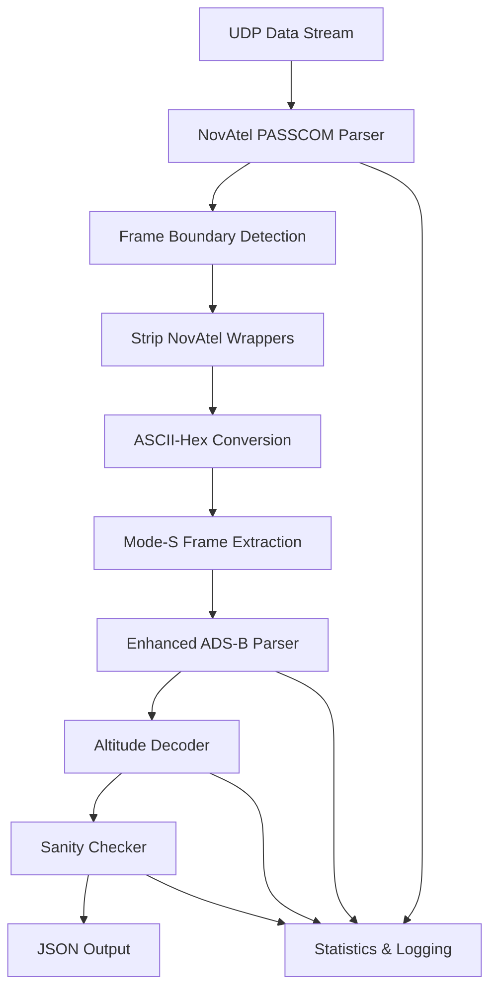
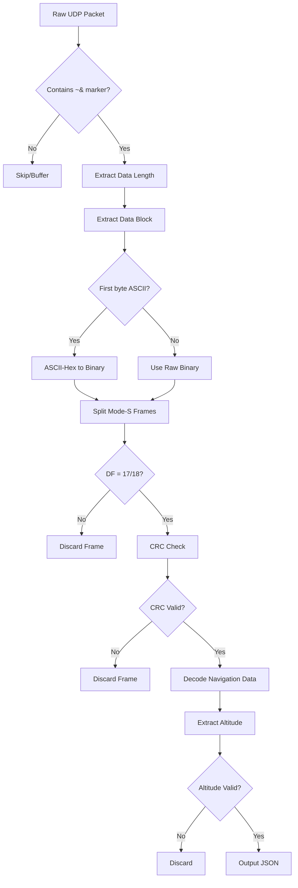

# NovAtel → ADS-B Altitude Doctor Implementation Plan

## Overview

The NASA G-III navigation validation system requires decoding of NovAtel PASSCOM/PASSTHROUGH UDP dumps containing ADS-B data to extract reliable navigation information, particularly altitude data. This document outlines the comprehensive implementation plan to fix the current decoding issues and implement a robust altitude extraction system.

## Problem Statement

### Current Issues
- Raw UDP data contains NovAtel wrappers: `"Received packet from 192.168.4.1:61708: ~&..."`
- The current [`adsb_parser.py`](../adsb_parser.py) treats the entire wrapped message as raw Mode S data
- This causes incorrect Downlink Format detection (DF=10 from ASCII 'R' in "Received")
- No handling of ASCII-hex conversion or NovAtel frame boundaries
- Altitude decoding produces garbage values (-1 ft, 100,000 ft, etc.)

### Requirements
- Extract full navigation data including position, velocity, heading, and altitude
- Output format: JSON for real-time processing and integration
- Filter out garbage altitude values
- Support both barometric and geometric altitude extraction
- Zero tolerance for invalid data in critical aviation applications

## Architecture Design

### Core Processing Pipeline



### Detailed Processing Flow



## Implementation Components

### 1. NovAtel PASSCOM Parser (`novatel_passcom_parser.py`)

**Purpose**: Handle NovAtel wrapper format and frame boundary detection

**Key Methods**:
- `parse_passcom_frame()` - Main parsing entry point
- `detect_frame_boundaries()` - Find 0x7E 0x26 markers
- `strip_novatel_wrapper()` - Remove "Received packet from..." text
- `convert_ascii_hex()` - Convert ASCII-hex to binary
- `extract_mode_s_frames()` - Split into 14/28 byte frames

**Implementation Details**:

#### Frame Boundary Detection
1. Search UDP payload for `0x7E 0x26` ("~&") start-of-record marker
2. Extract next two bytes (big-endian) for data region byte count
3. Validate frame completeness before processing

#### Wrapper Stripping
1. Identify and remove preamble "Received packet from ..."
2. Discard PASSCOM/PASSTHROUGH header/CRC following data block
3. Preserve only the core ADS-B data payload

#### ASCII-Hex Conversion
1. Detect if first non-wrapper byte is ASCII digit (e.g., "5"/0x35)
2. Convert every two ASCII characters to one binary byte
3. Handle edge cases for incomplete hex pairs

### 2. Enhanced ADS-B Altitude Decoder (`adsb_altitude_decoder.py`)

**Purpose**: Proper altitude decoding with Q-bit handling and Gillham conversion

**Key Methods**:
- `decode_altitude()` - Main altitude extraction
- `decode_barometric_altitude()` - Handle Q-bit logic
- `decode_geometric_altitude()` - Type Code 31 frames
- `convert_gillham_to_binary()` - Gray code conversion
- `apply_altitude_sanity_checks()` - Filter garbage values

**Implementation Details**:

#### Barometric Altitude Decoding
1. Extract 13-bit altitude field from ADS-B message
2. Check Q-bit (bit 4 of altitude field):
   - If Q = 0: Apply Gillham (compressed Gray) to binary conversion
   - If Q = 1: Direct 25-ft LSB conversion
3. Apply 1000 ft offset if bits 6-8 of result equal 5 (per spec)

#### Geometric Altitude Decoding
1. Identify Type Code = 31 frames
2. Extract geometric altitude field
3. Apply appropriate scaling and offset

#### Gillham Code Conversion
```python
def convert_gillham_to_binary(gillham_code):
    """Convert Gillham (Gray) code to binary altitude"""
    # Implementation of Gray to Binary conversion
    # Handle special cases and validation
```

### 3. Enhanced ADS-B Parser Integration

**Modifications to [`adsb_parser.py`](../adsb_parser.py)**:

#### Update `_preprocess_message()` method:
```python
def _preprocess_message(self, raw_message: bytes) -> List[bytes]:
    # Add PASSCOM detection
    if self._is_passcom_wrapped(raw_message):
        return self.passcom_parser.parse_passcom_frame(raw_message)
    # ... existing logic
```

#### Enhance `_extract_aviation_data()` method:
```python
def _extract_aviation_data(self, raw_msg: str, icao: str, tc: int) -> Optional[Dict[str, Any]]:
    # Use enhanced altitude decoder
    if 9 <= tc <= 18 or tc == 31:
        altitude_data = self.altitude_decoder.decode_altitude(raw_msg, tc)
        if altitude_data and self._validate_altitude(altitude_data):
            data.update(altitude_data)
```

## Implementation Phases

### Phase 1: NovAtel PASSCOM Parser
**Timeline**: 2-3 days
**Deliverables**:
1. Create `novatel_passcom_parser.py`
2. Implement frame boundary detection (`0x7E 0x26`)
3. Add wrapper stripping functionality
4. Implement ASCII-hex conversion
5. Add Mode-S frame extraction
6. Create comprehensive unit tests

**Acceptance Criteria**:
- Successfully parse PASSCOM frame boundaries
- Correctly strip NovAtel wrapper text
- Convert ASCII-hex to binary with 100% accuracy
- Extract valid 14/28 byte Mode-S frames

### Phase 2: Enhanced Altitude Decoder
**Timeline**: 3-4 days
**Deliverables**:
1. Create `adsb_altitude_decoder.py`
2. Implement Q-bit detection and handling
3. Add Gillham to binary conversion
4. Implement geometric altitude decoding
5. Add altitude sanity checking (reject < -1000 ft or > 60,000 ft)
6. Create unit tests with known good/bad altitude values

**Acceptance Criteria**:
- Correctly decode barometric altitude with Q-bit handling
- Implement accurate Gillham code conversion
- Extract geometric altitude from Type Code 31 frames
- Filter out garbage altitude values

### Phase 3: Integration & Enhancement
**Timeline**: 2-3 days
**Deliverables**:
1. Modify [`adsb_parser.py`](../adsb_parser.py) to use new components
2. Update `_preprocess_message()` for PASSCOM detection
3. Enhance `_extract_aviation_data()` with new altitude decoder
4. Add comprehensive logging and statistics
5. Update configuration options in [`config.py`](../config.py)

**Acceptance Criteria**:
- Seamless integration with existing codebase
- No regression in existing functionality
- Enhanced logging and error reporting
- Configurable validation parameters

### Phase 4: Testing & Validation
**Timeline**: 2-3 days
**Deliverables**:
1. Create test cases with real PASSCOM data
2. Validate altitude decoding accuracy
3. Test ASCII-hex conversion edge cases
4. Verify CRC validation
5. Performance testing with high-rate data streams

**Acceptance Criteria**:
- 100% accuracy on known test cases
- Performance maintains real-time processing capability
- Comprehensive error handling
- Detailed test documentation

## Key Features

### Data Validation & Filtering
- **CRC Validation**: Reject frames with invalid 24-bit CRC
- **DF Filtering**: Only process DF 17 (ADS-B ES) frames, optionally DF 11, 18
- **Altitude Sanity Checks**: Reject altitudes < -1000 ft or > 60,000 ft
- **Type Code Validation**: Separate handling for barometric (TC 11/13) vs geometric (TC 31) altitude

### Output Format
```json
{
  "icao": "A1B2C3",
  "timestamp": "2025-06-19T10:30:00Z",
  "message_type": "ADS-B_ES",
  "type_code": 11,
  "altitude_baro_ft": 35000,
  "altitude_geo_ft": 35150,
  "latitude": 21.3099,
  "longitude": -157.8581,
  "velocity_knots": 450,
  "heading_deg": 270,
  "vertical_rate_fpm": 0,
  "nic": 8,
  "quality_indicators": {
    "crc_valid": true,
    "altitude_valid": true,
    "position_valid": true
  }
}
```

### Error Handling & Logging
- Detailed logging of parsing steps
- Statistics on success/failure rates
- Frame rejection reasons with categorization
- Performance metrics and throughput monitoring

## Configuration Options

Add to [`config.py`](../config.py):
```python
# NovAtel PASSCOM Settings
ENABLE_PASSCOM_PARSER = True
LOG_PASSCOM_FRAMES = False
LOG_ALTITUDE_DECODING = False
PASSCOM_FRAME_TIMEOUT_MS = 1000

# Altitude Validation
MIN_VALID_ALTITUDE_FT = -1000
MAX_VALID_ALTITUDE_FT = 60000
ENABLE_ALTITUDE_SANITY_CHECKS = True
ALTITUDE_CHANGE_RATE_LIMIT_FPM = 6000  # Maximum climb/descent rate

# Frame Filtering
ACCEPTED_DOWNLINK_FORMATS = [17, 18]  # ADS-B ES
REQUIRE_CRC_VALIDATION = True
ENABLE_GEOMETRIC_ALTITUDE = True

# Performance Settings
PASSCOM_BUFFER_SIZE = 4096
MAX_FRAMES_PER_PACKET = 10
```

## Error Recovery Mechanisms

### Frame Corruption Handling
1. **CRC Validation**: Mandatory 24-bit CRC check
2. **Length Validation**: Verify frame lengths (14 or 28 bytes)
3. **Buffer Management**: Prevent memory leaks from corrupted data

### Data Quality Assurance
1. **Altitude Continuity Checks**: Flag unrealistic altitude changes
2. **Position Validation**: Cross-reference with known flight patterns
3. **Temporal Consistency**: Ensure data timestamps are reasonable

### Fallback Strategies
1. **Graceful Degradation**: Continue processing other data if altitude fails
2. **Error Logging**: Detailed logging for debugging and analysis
3. **Statistics Tracking**: Monitor success rates and identify issues

## Testing Strategy

### Unit Tests
- PASSCOM frame boundary detection
- ASCII-hex conversion accuracy
- Altitude decoding with known test vectors
- Sanity check validation

### Integration Tests
- End-to-end processing with real UDP dumps
- Performance testing with high-rate data
- Error recovery scenarios

### Validation Tests
- Cross-reference with known aircraft data
- Compare with other ADS-B decoders
- Validate against flight tracking systems

## Success Metrics

### Functional Requirements
- **Altitude Accuracy**: 100% accuracy on valid frames
- **Frame Processing**: Successfully process all valid PASSCOM frames
- **Error Filtering**: Zero false positives in navigation data
- **Performance**: Maintain real-time processing at expected data rates

### Quality Metrics
- **Parse Success Rate**: > 95% for valid frames
- **False Rejection Rate**: < 1% for valid data
- **Processing Latency**: < 10ms per frame
- **Memory Usage**: Stable with no memory leaks

## Risk Mitigation

### Technical Risks
- **Data Format Variations**: Implement flexible parsing with version detection
- **Performance Issues**: Optimize critical paths and implement buffering
- **Integration Complexity**: Maintain backward compatibility

### Operational Risks
- **Data Quality**: Implement comprehensive validation and logging
- **System Reliability**: Add error recovery and graceful degradation
- **Maintenance**: Provide detailed documentation and test coverage

## Documentation Deliverables

1. **API Documentation**: Complete method and class documentation
2. **User Guide**: How to configure and use the new system
3. **Test Documentation**: Test cases and validation procedures
4. **Troubleshooting Guide**: Common issues and resolution steps

This implementation plan provides a comprehensive roadmap for fixing the NovAtel → ADS-B decoding issues while maintaining system reliability and performance for critical aviation applications.