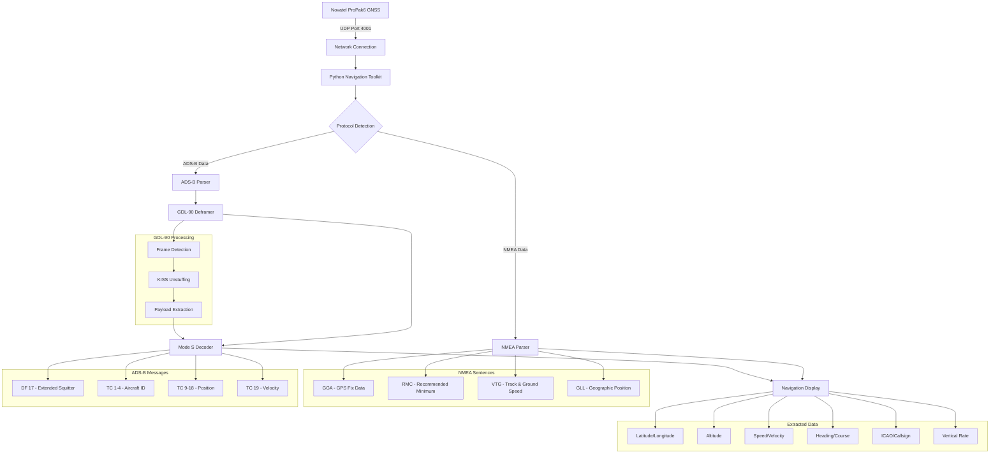

# Novatel ProPak6 Navigation Data Toolkit

## Project Overview
Create a comprehensive Python navigation data toolkit for the Novatel ProPak6 GNSS receiver that supports real-time data processing from multiple sources. The system supports triple protocols: NMEA 0183 navigation data, ADS-B aviation messages, and native Novatel binary/ASCII formats, with advanced GDL-90 deframing capabilities for extracting aviation data from wrapped UDP streams.

## Requirements
- Listen for UDP data on port 4001 (configurable)
- Parse NMEA 0183 format navigation data (GPS coordinates, altitude, speed, heading)
- Parse ADS-B aviation messages (aircraft position, callsign, velocity, vertical rate)
- Support GDL-90/KISS deframing for extracting ADS-B from wrapped data
- Protocol auto-detection and manual selection modes
- Display data in human-readable format with comprehensive statistics
- Robust error handling and network diagnostics

## Architecture Design



## Technical Implementation Plan

### 1. Core Components
- **UDP Socket Listener**: Bind to port 4001 and listen for incoming data (NMEA or ADS-B)
- **Protocol Detection**: Auto-detect data format or use manual selection
- **NMEA Parser**: Decode standard NMEA 0183 sentences
- **ADS-B Parser**: Decode Mode S Extended Squitter messages
- **GDL-90 Deframer**: Extract ADS-B messages from GDL-90/KISS wrapped data
- **Data Extractor**: Extract specific navigation and aviation parameters
- **Display Module**: Format and present data in human-readable form
- **Error Handling**: Robust error handling for network and parsing issues
- **Network Diagnostics**: Tools for troubleshooting connectivity issues

### 2. NMEA 0183 Sentences Supported
- **GGA (Global Positioning System Fix Data)**: Latitude, longitude, altitude, GPS quality
- **RMC (Recommended Minimum)**: Latitude, longitude, speed, course, date/time
- **VTG (Track Made Good and Ground Speed)**: Course and speed information
- **GLL (Geographic Position)**: Latitude, longitude, time of position

### 3. ADS-B Messages Supported
- **DF 17 (Extended Squitter)**: Primary ADS-B message format
- **TC 1-4 (Aircraft Identification)**: Callsign and aircraft category
- **TC 9-18 (Airborne Position)**: Latitude, longitude, altitude
- **TC 19 (Airborne Velocity)**: Ground speed, heading, vertical rate

### 4. GDL-90 Protocol Support
- **Frame Synchronization**: Detect 0x7E flag boundaries
- **KISS Deframing**: Handle HDLC byte stuffing (0x7D escape sequences)
- **Message Extraction**: Extract 14-byte ADS-B payloads
- **Validation**: Verify message integrity and format

### 5. Data Structures
```python
# NMEA Navigation Data
NavigationData = {
    'timestamp': datetime,
    'latitude': float,
    'longitude': float,
    'altitude': float,      # meters/feet
    'speed': float,         # knots
    'heading': float,       # degrees
    'gps_quality': int,
    'satellites': int,
    'status': str
}

# ADS-B Aviation Data
AviationData = {
    'timestamp': datetime,
    'icao': str,           # Aircraft ICAO address
    'callsign': str,       # Flight callsign
    'latitude': float,
    'longitude': float,
    'altitude': float,     # feet
    'ground_speed': float, # knots
    'track': float,        # degrees
    'vertical_rate': int,  # feet/minute
    'type_code': int,      # ADS-B type code
    'category': int        # Aircraft category
}
```

### 6. Features Implemented
- **Dual protocol support** (NMEA and ADS-B)
- **Protocol auto-detection** and manual selection
- **Real-time UDP listening** on specified network interface
- **GDL-90/KISS deframing** for wrapped ADS-B data
- **NMEA sentence validation** with checksum verification
- **ADS-B message decoding** with pyModeS integration
- **Coordinate conversion** (degrees/minutes to decimal degrees)
- **Unit conversion** (knots to mph/kmh, feet to meters)
- **Live display** with periodic updates and statistics
- **Comprehensive logging** with verbose debugging
- **Network diagnostics** and connectivity testing
- **Error recovery** for malformed packets
- **Complete test suite** with pytest integration

### 7. Dependencies
- `socket` (built-in): UDP networking
- `datetime` (built-in): Timestamp handling
- `threading` (built-in): Non-blocking display updates
- `signal` (built-in): Graceful shutdown handling
- `pynmea2` (external): Professional NMEA parsing library
- `pyModeS` (external): ADS-B message decoding library
- `pytest` (external): Testing framework

### 8. File Structure
```
wifi-udp-location/
├── main.py                      # Main application entry point
├── udp_listener.py              # UDP socket handling
├── nmea_parser.py               # NMEA sentence parsing
├── adsb_parser.py               # ADS-B message parsing
├── gdl90_deframer.py            # GDL-90/KISS deframing
├── navigation_display.py       # Human-readable output formatting
├── config.py                   # Configuration settings
├── network_diagnostic.py       # Network troubleshooting
├── run_tests.py                # Test runner
├── simple_test.py              # Dependency-free testing
├── test_udp_sender.py          # NMEA test data sender
├── test_adsb_sender.py         # ADS-B test data sender
├── requirements.txt            # Python dependencies
├── README.md                   # Usage instructions
├── PROJECT_PLAN.md             # Project documentation
├── INSTALLATION.md             # Installation guide
├── TROUBLESHOOTING.md          # Troubleshooting guide
├── TEST_DOCUMENTATION.md       # Test suite documentation
├── GDL90_IMPLEMENTATION_PLAN.md # GDL-90 technical details
├── GDL90_IMPLEMENTATION_SUMMARY.md # GDL-90 completion status
└── tests/                      # Comprehensive test suite
    ├── test_*.py               # Individual component tests
    └── __init__.py
```

### 9. Configuration Options
- Protocol mode selection (NMEA, ADS-B, auto-detect)
- UDP port (default: 4001)
- Network interface binding
- Update frequency for display
- Logging verbosity levels
- GDL-90 processing options
- Output format preferences
- Unit conversion settings

### 10. Error Handling Strategy
- Network connection failures
- Protocol detection errors
- Malformed NMEA sentences
- Invalid ADS-B messages
- GDL-90 frame corruption
- Missing GPS fix
- Invalid checksums
- Socket timeout handling
- Graceful degradation

## Sample Output Formats

### NMEA Navigation Mode
```
==================================================
     Novatel ProPak6 Navigation Data (NMEA)
==================================================
Timestamp: 2025-06-16 13:24:57 UTC

Position:  34.0522°N, 118.2437°W
Altitude:  35,000 ft (10,668 m)
Speed:     450 knots (833 km/h)
Heading:   095° (East-Northeast)
GPS:       3D Fix (8 satellites)
Status:    Active

------------------------------
Statistics:
  NMEA sentences parsed: 1247
  Parse errors: 3
  Success rate: 99.8%
  UDP Listener: Active
==================================================
```

### ADS-B Aviation Mode
```
==================================================
     Novatel ProPak6 Aviation Data (ADS-B)
==================================================
Timestamp: 2025-06-16 13:24:57 UTC

Position:  40.123456°N, 74.567890°W
Altitude:  35,000 ft
Speed:     450.0 knots (833.4 km/h)
Heading:   090° (East)
ICAO:      40621D
Callsign:  UAL123
Type Code: 11
V-Rate:    1,200 ft/min climbing

------------------------------
Statistics:
  ADS-B messages parsed: 852
  Aircraft tracked: 3
  GDL-90 frames processed: 425
  Parse errors: 2
  Success rate: 99.8%
  UDP Listener: Active
==================================================
```

## Implementation Status ✅ COMPLETED
1. ✅ Set up comprehensive project structure and dependencies
2. ✅ Create UDP socket listener with protocol detection
3. ✅ Implement NMEA parser with checksum validation
4. ✅ Implement ADS-B parser with pyModeS integration
5. ✅ Create GDL-90 deframer for wrapped ADS-B extraction
6. ✅ Build data extraction and conversion functions
7. ✅ Create human-readable display formatter for both protocols
8. ✅ Add comprehensive error handling and recovery
9. ✅ Create network diagnostic tools
10. ✅ Implement complete test suite with pytest
11. ✅ Test with sample NMEA and ADS-B data
12. ✅ Document usage, configuration, and troubleshooting