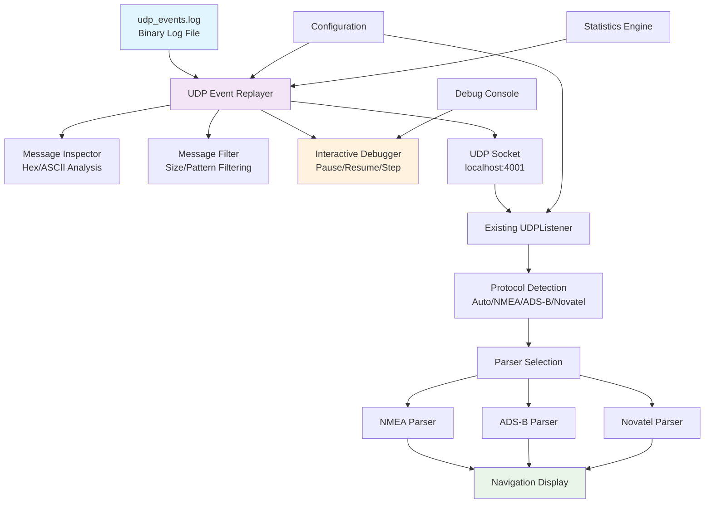
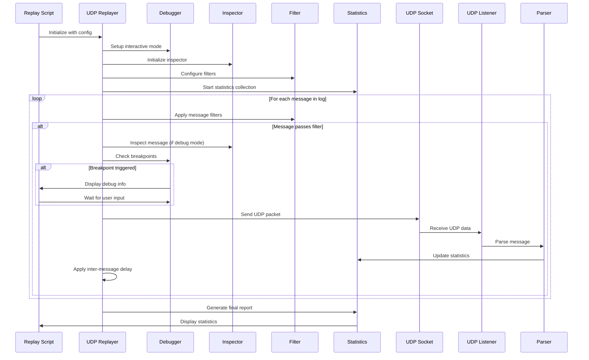

# UDP Event Replay System - Implementation Plan

## Overview

Create a comprehensive UDP replay system that reads binary messages from `data/udp_events.log` and replays them over UDP to test the existing Novatel navigation toolkit parsers. This system includes advanced debugging capabilities for interactive analysis of live flight data.

## System Architecture



## Core Components

### 1. UDP Event Replayer Class (`udp_replayer.py`)

**Purpose**: Core functionality to read, process, and replay binary log data

**Key Features**:
- Read binary data line by line from `data/udp_events.log`
- Send each message as UDP packet to configurable host:port
- Configurable replay speed (real-time, faster, slower)
- Loop mode for continuous testing
- Progress tracking and comprehensive statistics

**Class Structure**:
```python
class UDPReplayer:
    def __init__(self, log_file, target_host, target_port)
    def start_replay(self, speed_multiplier=1.0, loop_mode=False)
    def pause_replay(self)
    def resume_replay(self)
    def stop_replay(self)
    def step_single_message(self)
    def jump_to_message(self, message_number)
    def get_statistics(self)
```

### 2. Interactive Debugger (`interactive_debugger.py`)

**Purpose**: Provide interactive debugging capabilities during replay

**Interactive Features**:
- **Keyboard Controls**: 
  - Space bar: Pause/Resume
  - 'q': Quit
  - 's': Step-by-step mode
  - 'j': Jump to message number
  - 'f': Apply message filter
  - 'i': Inspect current message
  - 'r': Restart from beginning

- **Step-by-Step Mode**: Send one message at a time, wait for user input
- **Replay Position Control**: Jump to specific message numbers, rewind/fast-forward
- **Real-time Status Display**: Current message count, parsing results, error details

### 3. Message Inspector (`message_inspector.py`)

**Purpose**: Detailed analysis and inspection of binary messages

**Inspection Features**:
- **Hex Dump Display**: Raw binary data in hexadecimal format
- **ASCII Representation**: Text interpretation where applicable
- **Message Structure Analysis**: Size, headers, payload breakdown
- **Protocol Detection**: Attempt to identify message type (NMEA/ADS-B/Novatel)
- **Checksum Validation**: Verify message integrity where applicable

**Class Structure**:
```python
class MessageInspector:
    def inspect_message(self, binary_data)
    def hex_dump(self, binary_data, bytes_per_line=16)
    def ascii_representation(self, binary_data)
    def detect_protocol(self, binary_data)
    def analyze_structure(self, binary_data)
    def validate_checksum(self, binary_data, protocol_type)
```

### 4. Message Filter (`message_filter.py`)

**Purpose**: Filter messages based on various criteria for targeted debugging

**Filtering Capabilities**:
- **Size-based Filtering**: Include/exclude messages by byte size ranges
- **Pattern Matching**: Filter by binary patterns or signatures
- **Protocol-specific Filtering**: Focus on specific message types
- **Corruption Detection**: Skip malformed or corrupted messages
- **Custom Filter Functions**: User-defined filtering logic

**Filter Examples**:
```python
# Filter by message size (100-200 bytes)
filter.add_size_filter(min_size=100, max_size=200)

# Filter by binary pattern (Novatel sync bytes)
filter.add_pattern_filter(pattern=b'\xaa\x44\x12\x1c')

# Filter by protocol type
filter.add_protocol_filter(protocol='NMEA')

# Skip corrupted messages
filter.add_corruption_filter(skip_corrupted=True)
```

### 5. Breakpoint System (`breakpoint_manager.py`)

**Purpose**: Advanced debugging with conditional stopping points

**Breakpoint Types**:
- **Error Breakpoints**: Stop on parsing errors
- **Pattern Breakpoints**: Stop on specific message patterns
- **Count Breakpoints**: Stop after N successful/failed parses
- **Conditional Breakpoints**: Stop based on message content analysis
- **Performance Breakpoints**: Stop when parsing time exceeds threshold

### 6. Statistics Engine (`replay_statistics.py`)

**Purpose**: Comprehensive analysis and reporting of replay sessions

**Statistical Features**:
- **Message Distribution**: Count by protocol type, size, etc.
- **Parsing Success Rates**: Success/failure rates per message type
- **Performance Metrics**: Throughput, latency, processing times
- **Error Analysis**: Types and frequency of parsing errors
- **Protocol Detection Accuracy**: Auto-detection success rates

## Configuration Enhancements

### New Settings in `config.py`:
```python
# UDP Replay Configuration
REPLAY_LOG_FILE = 'data/udp_events.log'
REPLAY_TARGET_HOST = 'localhost'
REPLAY_TARGET_PORT = 4001
REPLAY_SPEED_MULTIPLIER = 1.0
REPLAY_LOOP_MODE = False
REPLAY_INTER_MESSAGE_DELAY = 0.01  # seconds

# Interactive Debugging
REPLAY_INTERACTIVE_MODE = False
REPLAY_STEP_MODE = False
REPLAY_PAUSE_ON_ERROR = False
REPLAY_HEX_DUMP_WIDTH = 16
REPLAY_MAX_INSPECT_BYTES = 1024

# Message Filtering
REPLAY_FILTER_MIN_SIZE = 0
REPLAY_FILTER_MAX_SIZE = float('inf')
REPLAY_FILTER_PATTERNS = []
REPLAY_SKIP_CORRUPTED = False

# Breakpoints
REPLAY_BREAKPOINT_ON_ERRORS = False
REPLAY_BREAKPOINT_PATTERNS = []
REPLAY_MAX_CONSECUTIVE_ERRORS = 10

# Statistics
REPLAY_ENABLE_STATISTICS = True
REPLAY_STATISTICS_INTERVAL = 100  # messages
REPLAY_SAVE_STATISTICS = False
REPLAY_STATISTICS_FILE = 'logs/replay_statistics.json'
```

## Command Line Interface

### Main Replay Script (`replay_udp_events.py`)

**Basic Usage**:
```bash
# Basic replay at normal speed
python replay_udp_events.py

# Fast replay for quick testing
python replay_udp_events.py --speed 5.0

# Continuous loop mode
python replay_udp_events.py --loop

# Custom target and file
python replay_udp_events.py --host 192.168.1.100 --port 5001 --file /path/to/other.log
```

**Interactive Debugging**:
```bash
# Full interactive debugging mode
python replay_udp_events.py --interactive --debug

# Step-by-step debugging with hex inspection
python replay_udp_events.py --step-mode --hex-dump

# Pause on parsing errors with message inspection
python replay_udp_events.py --pause-on-error --inspect
```

**Message Filtering**:
```bash
# Filter by message size
python replay_udp_events.py --filter-size 100-200

# Filter by binary pattern (hex)
python replay_udp_events.py --filter-pattern "aa4412"

# Skip corrupted messages
python replay_udp_events.py --skip-corrupted

# Focus on specific protocol
python replay_udp_events.py --protocol nmea
```

**Advanced Analysis**:
```bash
# Generate comprehensive statistics
python replay_udp_events.py --statistics --save-stats

# Performance analysis mode
python replay_udp_events.py --performance-mode

# Compare parsing results
python replay_udp_events.py --compare-mode --reference-file results.json
```

## Implementation Flow



## File Structure

```
novatel-nav-toolkit/
├── udp_replayer.py              # Core replayer class
├── interactive_debugger.py      # Interactive debugging
├── message_inspector.py         # Message analysis tools
├── message_filter.py           # Message filtering
├── breakpoint_manager.py       # Breakpoint system
├── replay_statistics.py        # Statistics engine
├── replay_udp_events.py        # Main CLI script
├── config.py                   # Enhanced configuration
├── data/
│   └── udp_events.log          # Binary log file
├── tests/
│   ├── test_udp_replayer.py    # Replayer tests
│   ├── test_message_inspector.py # Inspector tests
│   └── test_replay_integration.py # Integration tests
├── logs/
│   └── replay_statistics.json  # Generated statistics
└── docs/
    ├── UDP_REPLAY_IMPLEMENTATION_PLAN.md  # This document
    └── UDP_REPLAY_USER_GUIDE.md          # User guide
```

## Integration with Existing System

### Seamless Integration:
- **No changes needed** to existing `udp_listener.py`, `main.py`, or parsers
- **Backward compatibility** with current test infrastructure
- **Leverages existing** logging and display systems
- **Uses current** protocol detection and parsing logic

### Configuration Compatibility:
- **Respects existing** `config.py` settings
- **Adds new settings** without breaking existing functionality
- **Protocol modes** work with existing NMEA/ADS-B/Novatel parsers

## Testing Strategy

### Unit Tests:
- Test replayer class in isolation
- Validate message inspection functionality
- Test filtering and breakpoint systems
- Verify statistics collection accuracy

### Integration Tests:
- Full replay → parse → display pipeline
- Interactive debugging workflow
- Message filtering effectiveness
- Statistics accuracy validation

### Performance Tests:
- High-speed replay throughput
- Parser performance under load
- Memory usage during long replays
- CPU utilization analysis

### Validation Tests:
- Compare live vs. replayed parsing results
- Verify message integrity preservation
- Test protocol detection accuracy
- Validate statistical calculations

## Usage Scenarios

### Development Testing:
```bash
# Test new parser changes with known data
python replay_udp_events.py --loop --speed 2.0

# Debug specific parsing issues
python replay_udp_events.py --interactive --pause-on-error
```

### System Validation:
```bash
# Comprehensive system test
python replay_udp_events.py --statistics --save-stats

# Performance benchmarking
python replay_udp_events.py --speed 10.0 --performance-mode
```

### Interactive Analysis:
```bash
# Step through problematic messages
python replay_udp_events.py --step-mode --hex-dump --inspect

# Filter and analyze specific message types
python replay_udp_events.py --filter-size 50-100 --protocol novatel
```

## Expected Benefits

1. **Controlled Testing Environment**: Test parsers with real flight data in repeatable conditions
2. **Advanced Debugging**: Interactive analysis of parsing issues with detailed message inspection
3. **Performance Analysis**: Measure and optimize parser performance with known datasets
4. **Regression Testing**: Validate parser changes against historical flight data
5. **Protocol Analysis**: Better understand message patterns and protocol characteristics
6. **Development Acceleration**: Faster development cycles with consistent test data

## Implementation Priority

### Phase 1 - Core Functionality:
1. Basic UDP replayer class
2. Configuration enhancements
3. Simple CLI script
4. Basic message inspection

### Phase 2 - Interactive Features:
1. Interactive debugger
2. Pause/resume functionality
3. Step-by-step mode
4. Basic filtering

### Phase 3 - Advanced Analysis:
1. Advanced message filtering
2. Breakpoint system
3. Comprehensive statistics
4. Performance analysis

### Phase 4 - Polish & Documentation:
1. User guide documentation
2. Comprehensive testing
3. Performance optimization
4. Error handling improvements

This implementation plan provides a robust foundation for testing and debugging the Novatel navigation toolkit with real flight data, enabling both automated testing and interactive analysis capabilities.